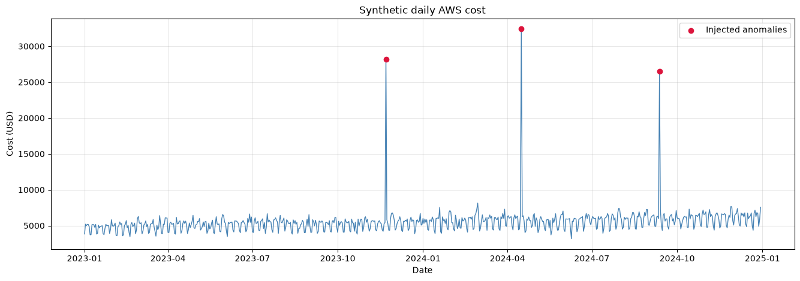
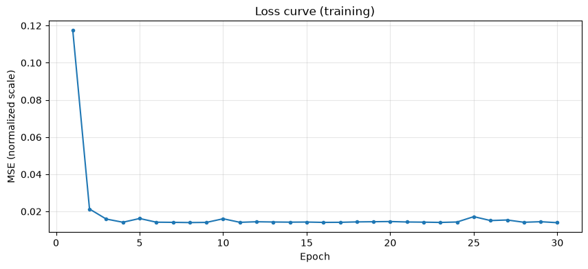
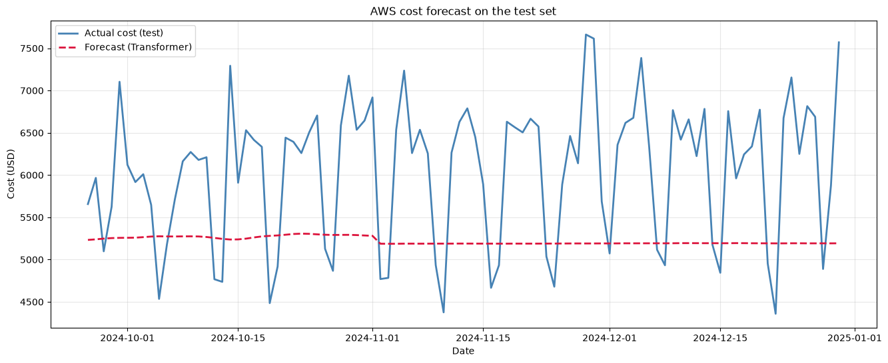

# AWS Cost Transformer Forecast

> When FinOps meets Deep Learning: forecasting cloud cost with Transformers.

## Pitch

As a Senior Cloud Operations Analyst focused on FinOps, I deal daily with
forecasting and optimizing AWS cost across 13+ enterprise accounts. This
project applies a Transformer architecture — implemented from scratch
(Positional Encoding, attention, training) during my postgraduate studies in
Mathematics and Applied Statistics for Data Science, ML and AI — to forecast
cloud cost time series, bringing together two worlds: FinOps domain
expertise and applied Deep Learning.

## Status

✅ Complete — all items below are done, see [Definition of Done](#definition-of-done).

## Stack

PyTorch · FastAPI · Docker · uv · pytest

## Architecture

```
cost(t-49) .. cost(t) → Linear(1→d_model) * sqrt(d_model) → + PositionalEncoding
                       → TransformerEncoder (nhead=2, num_layers=2) → mean(dim=time)
                       → Linear(d_model→1) → next-day forecast
```

The `TimeSeriesTransformer` is an encoder-only Transformer, implemented from
scratch (no Hugging Face) — a linear projection embeds the scalar cost value,
a sinusoidal Positional Encoding injects order, `nn.TransformerEncoder`
applies self-attention, and the result is mean-pooled over time before a
final linear layer projects back to a single forecasted value.

See **[docs/architecture.md](docs/architecture.md)** for the full write-up:
why sinusoidal positional encoding, why scale by `sqrt(d_model)`, why
mean-pooling, and the training pipeline (leak-free normalization, loss,
optimizer, autoregressive multi-step forecasting).

## Results

**Synthetic AWS cost series** — growth trend, weekly/monthly seasonality,
Savings Plans/RI step reductions, and injected anomalies, with no real
customer data:



**Training loss curve** — MSE drops sharply within the first few epochs and
then stabilizes:



**Forecast vs. actual on the held-out test set**:



## Project layout

```
aws-cost-transformer-forecast/
├── src/aws_cost_forecast/
│   ├── data/synthetic_aws_cost.py   # synthetic AWS cost series generator
│   ├── model/                       # PositionalEncoding + TimeSeriesTransformer
│   ├── training/train.py            # CLI training script
│   └── api/                         # FastAPI app (/forecast, /health)
├── notebooks/                       # training + evaluation + plots
├── tests/                           # pytest
└── docs/
    ├── architecture.md              # the math behind the model
    └── images/                      # plots embedded above
```

## Running it

```bash
# install dependencies
uv sync

# run the test suite
uv run pytest

# train the model (writes a checkpoint to checkpoints/model.pt)
uv run python -m aws_cost_forecast.training.train
# accepts flags to override defaults, e.g.:
uv run python -m aws_cost_forecast.training.train --epochs 50 --d-model 32

# serve the API locally
uv run uvicorn aws_cost_forecast.api.main:app --reload
```

### Docker

```bash
docker compose up -d api
```

> On Windows without native Docker Desktop, this runs fine inside WSL with
> Docker Engine + the `docker compose` v2 plugin.

### Calling the API

```bash
curl http://localhost:8000/health

curl -X POST http://localhost:8000/forecast \
  -H "Content-Type: application/json" \
  -d '{"historical_costs": [<exactly 50 daily cost values>], "steps": 7}'
```

`historical_costs` must contain exactly `input_window` values (50 by
default, matching the checkpoint the model was trained with); `steps`
controls how many days ahead to forecast (1–90).

## Definition of Done

- [x] `uv run pytest` passes 100% (35 tests)
- [x] `docker compose up` brings up the API and `/forecast` returns a coherent forecast
- [x] Notebook runs start to finish with no errors and generates the forecast plots
- [x] README explains the pitch, the architecture, and includes images/plots
- [x] No real customer or company data anywhere in the repo
